<p align="center"></p>

<h1 align="center">由 AI 自动完成 AutoDL 实例的开关机</h1>

<p align="center">
只需以自然语言说明任务（如“把训练跑起来”），AI 即自动开机、启动任务，并在任务结束后关机、记账。<br>
即使对话中断，实例空闲后仍会自动关机。
</p>

<p align="center">
<a href="#quick-start">快速开始</a> ·
<a href="#usage">如何使用</a> ·
<a href="#how">工作原理</a> ·
<a href="#money">费用控制</a> ·
<a href="#nogpu">无空闲 GPU 时的处理</a> ·
<a href="#notes">注意事项</a> ·
<a href="#faq">常见问题</a> ·
<a href="README.md">English</a>
</p>

<p align="center"></p>

<a id="why"></a>

## 背景与动机

AutoDL 按量计费的实例在开机期间持续计费，与 GPU 是否被使用无关，由此常出现以下情形。

- 训练在夜间结束，实例却持续开机至次日才被关闭
- 由 AI 自主运行实验时对话中途中断，实例无人关机
- 传输数据仅需无卡模式（每小时 0.1 元），但因切换模式繁琐而始终以有卡模式开机，且始终依赖人工操作

autodl-autogpu 旨在服务于自动化科研与自动化实验，同时节省费用。安装后，开机、关机以及有卡与无卡模式的切换均由 AI 自动完成，无需人工值守控制台，流程由 AI 与本 skill 的脚本自动推进。对于已采用自动科研工作流（如 ARIS）的项目，引入本 skill 即可使在 AutoDL 上运行实验的环节实现自动化，既节省费用，也减少人工操作。由此可避免两类情况，一是实验于夜间结束后实例空转至次日，造成不必要的支出；二是每次实验均需人工前往控制台开机，否则流程停滞。

本 skill 并不仅依赖 AI 的判断。实例上部署有守护程序，空闲时间达到设定时长即自动关机，即使 AI 的对话中断，仍可由守护程序自行判断并关机。此外设有预算记录，便于控制支出。

<a id="usage"></a>

## 如何使用

无需记忆命令，以自然语言说明需求即可。

| 用户指令 | 执行内容 |
|---|---|
| 把训练跑起来 | 核对余额与预算，以有卡模式开机，部署守护程序，启动任务并汇报 |
| 把数据传上去，传完就关机 | 开机并传输文件（授权范围包含无卡模式时以无卡模式开机，以节省费用），完成后关机并记账 |
| 这个月还剩多少预算 | 查询本机账本后答复，无需开机 |
| 按计划把实验跑完 | 其他实验类 skill 执行到需要使用该实例的步骤时，先调用本 skill，开机、启动任务与关机均由其完成 |

执行过程中不逐步请示，仅在开机后与关机后各汇报一次，示例如下。

```
已有卡开机（RTX 3080 Ti ×1，0.98 元/时，11:36:39 起计费）。空闲 15 分钟自动关机，未设最晚关机和定时关机。
已关机，11:45:26 停止计费，这次 8 分 47 秒，￥0.14；本项目累计有卡 0.60 小时，共 ￥0.61。
```

AI 仅在对话进行期间能够执行操作。如需其持续管理至关机，可令其在后台等待任务结束。若对话中途终止（应用关闭或网络中断），任务仍继续运行，结束后由实例上的守护程序按空闲关机，无需担心 GPU 空转。

<a id="how"></a>

## 工作原理

<p align="center"></p>

AI 运行于本机，经由两条途径操作实例。开机只能在 AutoDL 控制台的网页上完成，由 AI 通过浏览器操作；启动任务与关机经 SSH 完成。预算与用量账本保存在本机，每次开机前核对；守护程序运行于实例之上，在空闲时关机，不依赖 AI 的对话是否仍在进行。

<a id="quick-start"></a>

## 快速开始

### 1. 安装

本 skill 适用于 Claude Code 与 Codex，两者的安装位置不同。

```bash
# Claude Code
git clone https://github.com/grenbel/autodl-autogpu ~/.claude/skills/autodl-autogpu

# Codex
git clone https://github.com/grenbel/autodl-autogpu ~/.agents/skills/autodl-autogpu
```

也可将对应的命令直接发送给 AI，由其自行安装。运行环境由 AI 在首次使用时自行检查，缺少的依赖经用户同意后由 AI 安装，无需事先准备。

在 Codex 等对命令施加沙箱限制的环境中，本 skill 的命令需在沙箱之外运行，原因是它需要联网（SSH）、读取 SSH 密钥，并在用户目录下保存仅用户本人可访问的记录。首次使用时 AI 会说明原因并请求批准。在 Windows 上，仅为沙箱增加可写目录与网络权限并不足以运行这些命令。

### 2. 首次配置

在项目中告知 AI 该项目使用 AutoDL 实例，例如

```
这个项目的实验在 AutoDL 上跑，用 autodl-autogpu 管开关机
```

首次使用时，AI 会引导完成以下配置。各项均由 AI 提问、用户回答，AI 能够自行获取的信息不再询问。

**建立 SSH 连接。** AI 检查本机环境并生成专用密钥，随后给出一行公钥。将该公钥粘贴至 AutoDL 控制台实例列表上方的“设置SSH免密登录”，每台电脑只需操作一次，对账号下全部实例生效。若已有添加过的密钥，告知 AI 即可。

随后需向 AI 提供实例的连接方式。在控制台的实例列表中，每台实例所在行靠右有“SSH登录”一栏，点击其中“登录指令”旁的复制按钮，将复制的内容发送给 AI，其形式如下。

```
ssh -p 12345 root@connect.demo.seetacloud.com
```

该栏仅在实例运行时显示，关机时为空。因此首次使用时，需在实例开机之后再将登录指令复制给 AI，其下方的密码无需提供。

**在浏览器中登录 AutoDL。** AI 所使用的浏览器（如 Claude 桌面应用的内置浏览器）需处于 AutoDL 已登录状态，登录由用户本人完成。

**确认使用设置。** AI 依次询问下列事项。

| 询问事项 | 回答示例 |
|---|---|
| 使用哪台实例 | 提供实例列表第一列中的实例 ID |
| 有卡与无卡模式的用法 | “传数据用无卡，跑实验用有卡”，或“只用有卡”“只用无卡” |
| 预算 | “本月最多 100 元”“总计 20 个 GPU 小时”，或“不设” |
| 空闲多久后自动关机 | 通常为 15 分钟，可同时指定最晚关机时间或平台定时关机 |
| 无空闲 GPU 时是否自动克隆 | 默认不开启，需要时明确回答开启，见[无空闲 GPU 时的处理](#nogpu) |
| 无空闲 GPU 时等待多久 | 默认 30 分钟，可指定其他时长 |

配置完成后，实例与守护程序的设置写入项目说明文件的 `## AutoDL` 段（Claude Code 为 `CLAUDE.md`，Codex 为 `AGENTS.md`），模式用法与预算保存在本机，后续对话直接沿用。若 AI 未自动启用本 skill，可直接点名调用，在 Claude Code 中输入 `/autodl-autogpu`，在 Codex 中输入 `$autodl-autogpu`。

> 用户给出的模式用法与预算即为授权。在此范围内，AI 自行开机并产生费用，不再逐次请示。授权不设有效期，按实例保存在本机，对任意项目的对话均有效，可随时要求 AI 查看、修改或撤销。

<a id="money"></a>

## 费用控制

<p align="center"></p>

费用由三道机制共同约束，各自作用于不同环节。

- **预算关口**作用于开机之前。设有预算时，AI 在每次开机前估算本次费用，预算不足则不开机，接近用尽时先征询用户。控制台出现欠费、余额不足或维护提示时同样不开机，并告知用户。
- **守护程序**运行于实例之上，每分钟检测一次 GPU、CPU、磁盘与网络的占用，空闲达到设定时长即关机。它随实例启动，不依赖 AI 的对话是否仍在进行。
- **控制台定时关机**为可选项，到达设定时刻由平台直接关机，无论任务是否完成。它是唯一确定生效的上限，但会中断正在运行的任务，因此仅在用户要求时设置。唯一的例外是守护程序尚未就绪的那一次开机（首次在某台实例上使用，或重置系统、更换镜像之后），此时 AI 会先设置一个 30 分钟后的临时定时关机作为兜底，待守护程序就绪后自行取消。控制台上出现该定时属正常现象，请勿手动取消。

前两道机制存在以下局限。

- 进程挂起但仍占用 GPU 或 CPU 时，守护程序视其为使用中，不会关机。无法读取的信号同样按使用中处理。
- 任务含有长时间的低占用阶段（等待外部数据、休眠、等待定时触发，或占用很低的轻量活动）时，守护程序可能将其判为空闲并关机。此类任务需事先告知 AI，由其为相应阶段声明安静期。
- 预算仅在开机前以及需要延长运行时检查。任务超出计划时长后不再复核。
- 可选的“最晚关机”到点后不中断仍在运行的任务，待任务结束后才关机。

如需严格的费用上限，可要求 AI 在每次开机时设置控制台定时关机。

<a id="nogpu"></a>

## 无空闲 GPU 时的处理

AutoDL 的实例绑定于特定主机，关机后不保留 GPU。再次开机时，若该主机的 GPU 已被占满，则无法以有卡模式开机。

<p align="center"></p>

默认的处理方式是等待。AI 每隔数分钟查询一次，出现空闲 GPU 即开机。等待时长默认 30 分钟，可在首次配置时指定；超过该时长仍无空闲 GPU 时，AI 告知用户并停止等待，经用户同意后方继续。

另一种方式是“没有空闲卡时自动克隆”。该功能默认关闭，是否开启由 AI 在首次配置时询问。开启后，等待超过设定时长仍无空闲 GPU 时，AI 新租一台配置相同的实例，复制系统盘与数据盘，并将任务迁移至新实例继续运行，全程无需用户在场。

该功能会产生额外费用，开启前需了解以下事项。

- 开启即表示预先同意相应花费。触发时 AI 不再询问，仅在执行前告知所租实例的规格与价格。
- 配置相同指同一地区，GPU 型号、卡数、每卡的 CPU 核数与内存均相同，且单价不高于原实例。找不到符合条件且有空闲 GPU 的主机时不克隆，继续等待并告知用户。
- 新实例自创建起计费，须通过与开机相同的预算关口，并与原实例共用同一预算。原实例有付费扩容的数据盘时，新实例同样扩容，此后两台实例每天各扣一笔扩容费，关机期间照扣，直至释放其中一台。
- 原实例由用户自行释放，AI 不执行释放操作。迁移完成后，AI 会报告数据核对情况、原实例每日仍在产生的费用，以及平台自动释放它的日期。
- 克隆过程中若对话中断且无人接手，新实例到达预定时刻后自动关机，不会持续空转。
- 一次克隆了结之前，请勿自行对原实例执行克隆或保存镜像，否则由此产生的实例也会被自动关机。了结时 AI 会告知。
- 克隆前后，AI 会以无卡模式将原实例开机两次，每次数分钟，分别用于准备与收尾。

<a id="notes"></a>

## 注意事项

**守护程序会保留在实例上。** 首次部署后，守护脚本位于数据盘（`/root/autodl-tmp/.autodl-guard/`），开机钩子位于系统盘（`/etc/profile.d/autodl-autogpu-guard.sh`），此后每次开机守护程序均自动启动，并沿用上一次的设置。由此需注意以下情形。

- 不经 AI、自行在控制台开机时，守护程序同样生效。终端、Jupyter、screen 或 tmux 处于打开状态不视为使用，若仅查看文件而不运行任务，空闲达到设定时长后实例会被关机。需要保持开机时，告知 AI 保留的时长即可。
- 自行开机之前，应先检查该实例所在行是否仍有定时关机，如有则取消或修改，否则到点后实例会被平台关机。对话中途中断时，AI 设置的定时关机可能未被取消。
- 重置系统或更换镜像后，开机钩子可能随系统盘一并失效，下次开机前请告知 AI。
- 以该实例保存镜像或克隆实例时，守护脚本与开机钩子可能被一并复制，在新的实例上同样会自动启动，并按相同设置关机。
- 不需要守护程序随开机自动启动时，可要求 AI 卸载开机钩子，自下一次开机起生效。

**本 skill 不执行的操作。** 不输入密码，不处理验证码，不保存令牌，也不向用户索取密码或私钥内容。在控制台上仅点击开机、无卡模式开机以及定时关机的设置与取消；开启自动克隆后，另包括克隆与创建实例所需的固定步骤。释放、重置系统、更换镜像、升降配置、迁移、转包月、充值与续费均不执行，费用与账单页面仅读取收支明细以核对扣费。强制关机会中断任务，须经用户当场同意。

**数据与隐私。** 授权、预算与用量账本保存在本机的 `~/.autodl-autogpu`，开关机记录保存在项目目录的 `.autodl/power_log.jsonl`，均不上传。控制台页面脚本仅读取控制台页面并点击上述固定按钮，不发起网络请求，不读取 cookie。收支明细页面包含账号下全部实例的扣费记录与余额，AI 仅使用所管理实例的记录，余额仅用于当次核算，不予保存。

<a id="faq"></a>

## 常见问题

<details>
<summary><b>对话结束后，实例是否会持续运行</b></summary>

任务继续运行，结束后由守护程序按空闲关机。守护程序依据实际占用判断，进程挂起但仍占用 GPU 或 CPU 时不会关机，任务长时间处于低占用阶段时则可能被提前关机，见[费用控制](#money)。如需确定的上限，可要求 AI 在每次开机时设置控制台定时关机。

</details>

<details>
<summary><b>所用环境没有浏览器工具时能否使用</b></summary>

可以。自动开机依赖能够在页面中执行脚本的浏览器工具（如 Claude 桌面应用的内置浏览器）。不具备该工具时（例如未配置此类工具的 Codex），关机、守护程序与任务执行仍自动完成，开机需由用户在控制台点击，AI 会说明点击哪一行的哪个按钮以及点击的时机，关机后的核对也需用户读取控制台上的信息。

</details>

<details>
<summary><b>如何查看、修改或撤销授权</b></summary>

直接向 AI 提出即可。授权按实例保存在本机，不设有效期，对任意项目的对话均有效。

</details>

<details>
<summary><b>实例长期不使用会怎样</b></summary>

按平台规则，实例连续关机 15 天后被释放，数据随之清空。AI 读取控制台时会同时查看释放倒计时，不足 3 天时提醒用户。

</details>

<a id="license"></a>

## 许可证

MIT，见 `LICENSE`。Copyright (c) 2026 grenbel。
