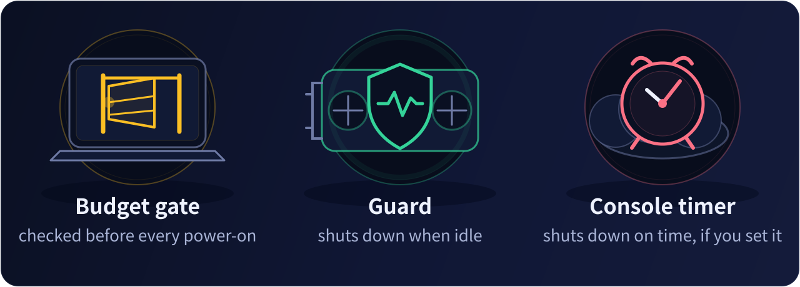

<p align="center"></p>

<h1 align="center">AI-driven automatic power-on and shutdown for AutoDL instances</h1>

<p align="center">
State the task in natural language (for example, "start the training"); the AI powers the instance on, starts the job, and shuts down and books the cost once the job has finished.<br>
Even if the conversation is lost, the instance shuts down automatically once it is idle.
</p>

<p align="center">
<a href="#quick-start">Quick start</a> ·
<a href="#usage">Usage</a> ·
<a href="#how">How it works</a> ·
<a href="#money">Cost control</a> ·
<a href="#nogpu">When no GPU is free</a> ·
<a href="#notes">Notes</a> ·
<a href="#faq">FAQ</a> ·
<a href="README.cn.md">中文</a>
</p>

<p align="center"></p>

<a id="why"></a>

## Background and motivation

A pay-as-you-go AutoDL instance is billed for as long as it is powered on, whether or not the GPU is in use. The following situations are common as a result.

- A training run finishes during the night, and the instance remains powered on until it is shut down the next day
- An AI runs the experiments autonomously, its conversation is interrupted, and nobody shuts the instance down
- Data transfer needs only the non-GPU mode (0.1 yuan per hour), but switching modes is tedious, so the instance is kept in GPU mode and always depends on manual operation

autodl-autogpu serves automated research and automated experiments, and it reduces cost. Once it is installed, power-on, shutdown and the switch between GPU and non-GPU mode are all carried out by the AI, nobody has to attend to the console, and the AI and the skill's scripts carry the workflow forward. For a project that already uses an automated research workflow (ARIS, for example), adding this skill automates the step of running experiments on AutoDL, which reduces both cost and manual work. Two situations are thereby avoided: an instance that idles from the end of a run at night until the next day at needless expense, and a workflow that stalls because someone has to power the instance on in the console before every experiment.

The skill does not rely on the AI's judgement alone. A guard program deployed on the instance shuts it down once it has been idle for the configured time, and it decides and acts by itself even when the AI's conversation has been interrupted. In addition, a budget record helps to keep the spending under control.

<a id="usage"></a>

## Usage

No commands need to be memorised; state the request in natural language.

| Instruction | What is done |
|---|---|
| start the training | checks the balance and the budget, powers on in GPU mode, deploys the guard, starts the job and reports |
| upload the data and shut down once it is copied | powers on and transfers the files (in non-GPU mode when the permission includes it, to reduce cost), then shuts down and books the cost |
| how much of this month's budget is left | answers from the local ledger; no power-on is needed |
| run the experiments of the plan | when another experiment skill reaches a step that needs the instance, it invokes this skill first; power-on, starting the jobs and shutdown are all carried out through it |

It does not ask for confirmation at each step. It reports once after the power-on and once after the shutdown, as in the following example.

```
Powered on with GPU (RTX 3080 Ti x1, 0.98 yuan/h, billed from 11:36:39). Shuts down after 15 idle minutes; no latest shutdown, no console timer.
Shut down. Billing stopped at 11:45:26: 8 min 47 s this time, 0.14 yuan; 0.60 GPU hours and 0.61 yuan in this project so far.
```

The AI can act only while the conversation is active. To have it manage the instance until shutdown, let it wait in the background for the job to finish. If the conversation ends midway (the application is closed or the network is interrupted), the job continues, and the guard on the instance shuts it down once it is idle, so the GPU is not left running unused.

<a id="how"></a>

## How it works

<p align="center"></p>

The AI runs on the local computer and reaches the instance by two routes. Power-on is possible only on the web page of the AutoDL console, which the AI operates through a browser; jobs are started and the instance is shut down over SSH. The budget and the usage ledger are kept on the local computer and checked before every power-on. The guard runs on the instance and shuts it down when idle, whether or not the AI's conversation is still active.

<a id="quick-start"></a>

## Quick start

### 1. Installation

The current version is for Claude Code. A version for Codex will follow.

```bash
git clone https://github.com/grenbel/autodl-autogpu ~/.claude/skills/autodl-autogpu
```

Alternatively, this command can be sent to the AI, which then installs the skill itself. The AI checks the local environment at first use and, with the user's consent, installs whatever is missing; nothing has to be prepared in advance.

Where the environment runs commands in a sandbox, the skill's commands have to run outside the sandbox, because they need network access (SSH), read the SSH key, and keep a record under the user's home directory that only the user can access. At first use the AI explains this and asks for approval.

### 2. First-time setup

In the project, tell the AI that the project uses an AutoDL instance, for example

```
This project's experiments run on AutoDL. Use autodl-autogpu to power the instance on and off.
```

At first use the AI guides the user through the following setup. Each item is asked by the AI and answered by the user; the AI does not ask for what it can determine by itself.

**Establishing the SSH connection.** The AI checks the local environment, generates a dedicated key and returns one line, the public key. Paste it under "设置SSH免密登录" above the instance list in the AutoDL console. This is done once per computer and applies to every instance of the account. If a key has already been added to AutoDL, tell the AI which one.

The AI then needs the connection details of the instance. In the instance list of the console, each row has a column "SSH登录" towards the right. Click the copy button next to "登录指令" (login command) and send the copied text to the AI. It has the following form.

```
ssh -p 12345 root@connect.demo.seetacloud.com
```

The column is shown only while the instance is running and is empty when the instance is shut down. At first use, the login command is therefore provided after the instance has been powered on. The password shown below it is not needed.

**Logging in to AutoDL in the browser.** The browser used by the AI (for example the built-in browser of the Claude desktop app) must be logged in to AutoDL. The login is performed by the user.

**Confirming the settings.** The AI asks about the following items in turn.

| Item | Example answer |
|---|---|
| Which instance to use | the instance ID from the first column of the instance list |
| How GPU and non-GPU modes are used | "non-GPU for moving data, GPU for experiments", or "GPU only", "non-GPU only" |
| Budget | "at most 100 yuan this month", "20 GPU hours in total", or "none" |
| Idle time before automatic shutdown | usually 15 minutes; a latest shutdown time or a console timer can be specified as well |
| Whether to clone automatically when no GPU is free | off by default; answer explicitly to turn it on, see [When no GPU is free](#nogpu) |
| How long to wait when no GPU is free | 30 minutes by default; another duration can be specified |

After the setup, the settings of the instance and of the guard are written to the `## AutoDL` section of the project's instruction file `CLAUDE.md`, and the modes and the budget are stored on the local computer. Later conversations use them directly. If the AI does not invoke the skill by itself, call it by name with `/autodl-autogpu`.

> The modes and the budget given by the user constitute the permission. Within them the AI powers the instance on and incurs cost on its own, without asking each time. The permission does not expire, is stored per instance on the local computer, and is valid for conversations in any project. The user can ask the AI to show, change or revoke it at any time.

<a id="money"></a>

## Cost control

<p align="center"></p>

Three mechanisms constrain the cost, each at a different stage.

- **The budget gate** acts before a power-on. When a budget is set, the AI estimates the cost of the run before each power-on; if the budget is insufficient it does not power on, and when the budget is nearly used up it asks the user first. It also does not power on when the console shows a notice about arrears, a low balance or maintenance, and informs the user instead.
- **The guard** runs on the instance. Once a minute it measures the use of the GPU, the CPU, the disk and the network, and it shuts the instance down when the idle time reaches the configured value. It starts with the instance and does not depend on whether the AI's conversation is still active.
- **The console timer** is optional. At the set time the platform shuts the instance down regardless of whether the job has finished. It is the only limit that is certain to take effect, but it interrupts running jobs, so it is set only at the user's request. The one exception is a power-on at which the guard is not yet in place (the first use of an instance, or after a system reset or a change of image): the AI then sets a provisional shutdown timer 30 minutes ahead as a backstop and cancels it itself once the guard is in place. Such a timer appearing in the console is normal; do not cancel it by hand.

The first two mechanisms have the following limitations.

- A process that hangs while still occupying the GPU or the CPU is treated as in use, and the guard does not shut down. A signal that cannot be read is treated as in use as well.
- A job with long phases of low activity (waiting for external data, sleeping, waiting for a scheduled trigger, or very light work) may be judged idle, and the guard may then shut the instance down. Tell the AI about such phases in advance, so that it declares a quiet period for them.
- The budget is checked only before a power-on and before a run is extended. It is not checked again when a job exceeds its planned duration.
- The optional "latest shutdown" does not interrupt a job that is still running at that time; the instance shuts down after the job ends.

For a strict cost limit, ask the AI to set the console timer at every power-on.

<a id="nogpu"></a>

## When no GPU is free

An AutoDL instance is bound to a specific host and does not keep its GPU after shutdown. If all GPUs of that host are occupied when the instance is powered on again, it cannot start in GPU mode.

<p align="center"></p>

By default the AI waits. It checks every few minutes and powers on as soon as a GPU is free. The waiting time is 30 minutes by default and can be specified during the first-time setup; when it is exceeded, the AI informs the user and stops waiting, and continues only with the user's consent.

The alternative is cloning when no GPU is free. The feature is off by default; whether to turn it on is asked by the AI during the first-time setup. When it is on and no GPU has become free within the configured waiting time, the AI rents a second instance with the same configuration, has the system disk and the data disk copied, and moves the job to the new instance, where it continues. The user does not need to be present.

The feature incurs additional cost. The following should be understood before turning it on.

- Turning it on constitutes consent in advance to the corresponding spending. When it is triggered the AI does not ask again; it only states the specification and the price of the instance before renting it.
- The same configuration means the same region, the same GPU model and count, the same CPU cores and memory per GPU, and a unit price not higher than that of the original. If no host meets these conditions and has a free GPU, the AI does not clone; it keeps waiting and informs the user.
- The new instance is billed from its creation, passes the same budget gate as a power-on, and shares one budget with the original. If the original has a paid expansion of its data disk, the new instance is expanded in the same way, and from then on both instances are charged the daily expansion fee, also while shut down, until one of them is released.
- The original instance is released by the user; the AI never performs a release. After the migration the AI reports how far the data was verified, what the original still costs per day, and the date on which the platform will release it automatically.
- If the conversation is interrupted during a clone and nobody takes over, the new instance shuts itself down at a predetermined time and does not keep running idle.
- Until a clone is closed, do not clone the original instance or save an image of it manually; an instance created that way would be shut down automatically as well. The AI states when the clone is closed.
- Before and after a clone, the AI powers the original instance on in non-GPU mode twice, for a few minutes each, for preparation and for cleanup.

<a id="notes"></a>

## Notes

**The guard remains on the instance.** After the first deployment the guard script resides on the data disk (`/root/autodl-tmp/.autodl-guard/`) and a boot hook on the system disk (`/etc/profile.d/autodl-autogpu-guard.sh`). From then on the guard starts automatically at every power-on, with the settings of the previous run. The following cases therefore need attention.

- When the instance is powered on in the console without the AI, the guard is active as well. An open terminal, Jupyter, screen or tmux session does not count as use; if files are only inspected and no job runs, the instance is shut down once the idle time reaches the configured value. To keep it running, tell the AI for how long.
- Before powering on manually, check whether the instance's row still shows a shutdown timer, and cancel or change it; otherwise the platform shuts the instance down at that time. A timer set by the AI may remain if the conversation was interrupted.
- After a system reset or a change of image the boot hook may be lost together with the system disk. Tell the AI before the next power-on.
- When an image of the instance is saved or the instance is cloned, the guard script and the boot hook may be copied along; on the new instance the guard then starts automatically as well and shuts down by the same settings.
- If the guard should not start with the instance, ask the AI to remove the boot hook. This takes effect from the next power-on.

**Operations the skill does not perform.** It does not enter passwords, handle captchas or store tokens, and it does not ask the user for a password or the content of a private key. In the console it clicks only power on, power on without GPU, and setting and cancelling the shutdown timer; with automatic cloning turned on, also the fixed steps needed to clone and create an instance. It does not release, reset, change the image, resize, migrate, switch to monthly billing, recharge or renew, and on the pages for costs and bills it only reads the billing detail in order to verify charges. A forced shutdown interrupts running jobs and requires the user's consent at that moment.

**Data and privacy.** The permission, the budget and the usage ledger are stored on the local computer in `~/.autodl-autogpu`, and the power log in `.autodl/power_log.jsonl` in the project directory; neither is uploaded. The page script only reads the console page and clicks the fixed buttons named above; it sends no network requests and reads no cookies. The billing detail page shows the charges of every instance of the account and the balance; the AI uses only the records of the instance it manages, and the balance is used for the current calculation only and is not stored.

<a id="faq"></a>

## FAQ

<details>
<summary><b>Does the instance keep running after the conversation has ended?</b></summary>

The job continues, and afterwards the guard shuts the instance down once it is idle. The guard judges by actual use: it does not shut down while a hung process still occupies the GPU or the CPU, and it may shut down early when a job stays at low activity for long, see [Cost control](#money). For a definite limit, ask the AI to set the console timer at every power-on.

</details>

<details>
<summary><b>Can it be used in an environment without a browser tool?</b></summary>

Yes. The automatic power-on depends on a browser tool that can run a script in the page (the built-in browser of the Claude desktop app, for example). Without such a tool, shutdown, the guard and the jobs remain automatic; the power-on is clicked by the user in the console, and the AI states which button of which row to click and when. The checks after a shutdown also require the user to read information from the console.

</details>

<details>
<summary><b>How is the permission shown, changed or revoked?</b></summary>

Ask the AI. The permission is stored per instance on the local computer, does not expire, and is valid for conversations in any project.

</details>

<details>
<summary><b>What happens to an instance that is not used for a long time?</b></summary>

By the platform's rule, an instance that has been shut down for 15 consecutive days is released and its data is erased. When the AI reads the console it also checks the release countdown and reminds the user when fewer than 3 days remain.

</details>

<a id="license"></a>

## License

MIT, see `LICENSE`. Copyright (c) 2026 grenbel.
